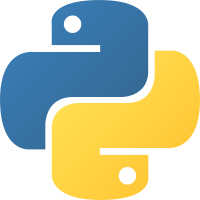
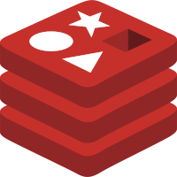
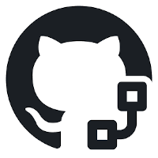
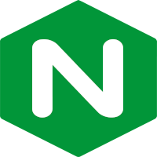
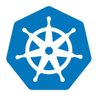
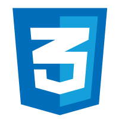
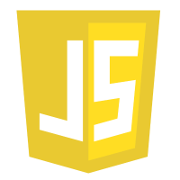

<h1 align=center>Hi, I`m Gandori (Marcel Stiebing)</h1>

Self-taught backend developer passionate about scalable systems and continuous learning.

Good code in software development doesn`t wait; it reacts dynamically! Use Event-Driven-Architecture (EDA)!

 Use Event-Sourcing (ES)! Because it`s more than just data.

<h4 align="center">Main Technologies</h4>

  
  
  
  
  
  

  
  
  
  
  
  

***

<h4 align="center">Technologies</h4>

   
   
   
     
   
   

